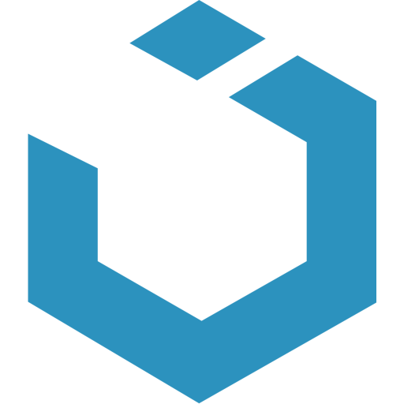

# Electron Tasks

A task app to keep track of your action items across all of your projects.

This app was created using the following stack:

|                                                   | Name              | Type                                  |                    Link                     |
| ------------------------------------------------- | ----------------- | ------------------------------------- | :-----------------------------------------: |
|  | <h2>Electron</h2> | <em>Native Application Framework</em> | [Check It Out](https://www.electronjs.org/) |
|    | <h2>Svelte</h2>   | <em>Component Framework</em>          |     [Check It Out](https://svelte.dev/)     |
|     | <h2>UIkit</h2>    | <em>CSS Framework</em>                |    [Check It Out](https://getuikit.com/)    |
